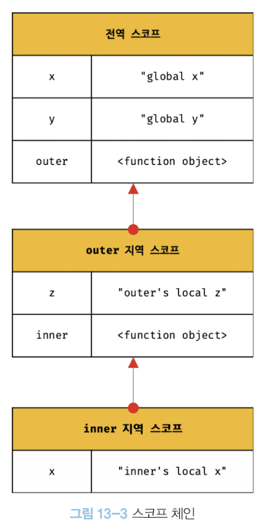

# 스코프의 종류

코드는 전역과 지역으로 구분 가능합니다.
이 때, 변수는 자신이 선언된 범위에 따라 전역 변수와 지역 변수로 구분됩니다.

전역은 코드의 가장 바깥 영역이며, 전역 스코프를 생성합니다.

전역 변수는 어디서든 참조 가능합니다.

지역이란 함수 몸체 내부이며, 지역 스코프를 생성합니다. 지역에 선언된 변수는 지역 변수라고 칭합니다. **지역 변수는 자신의 지역 스코프와 하위 지역 스코프에서만 유효합니다.**

---

# 스코프 체인

함수는 전역에서도 정의가 가능하고, 함수 몸체 내부에서도 정의가 가능합니다. 함수 몸체 내부에서 정의했을 때, 이를 중첩 함수라고 부르며 중첩 함수를 포함하는 함수는 외부 함수라고 부릅니다.

함수가 중첩 가능하다는 것은 함수의 지역 스코프 또한 중첩이 가능하다는 소리입니다. 이는 스코프가 함수 중첩에 의해 **계층적 구조를 갖는다** 라는 의미입니다.

외부 함수와 중첩 함수가 계층적 구조를 가질 때, 외부 함수의 지역 스코프를 중첩 함수의 상위 스코프라고 합니다.

이와 같이 outer 함수 지역과 inner 함수 지역이 있을 때 위 그림과 같은 하나의 계층적 구조로 연결됩니다. 또한 모든 지역 스코프의 최상위 스코프는 전역 스코프가 됩니다.

이처럼 스코프가 계층적으로 연결된 것을 **스코프 체인** 이라고 합니다.

변수를 참조하게 될 경우 자바스크립트 엔진은 스코프 체인을 통해 변수를 참조하는 코드의 스코프에서부터 시작하여 상위로 이동하며 변수를 검색합니다. 이를 통해서 상위 스코프를 하위 스코프에서 참조가 가능한 것입니다.

즉, 좁은 범위의 스코프에서 넓은 범위의 스코프로 올라갑니다.
