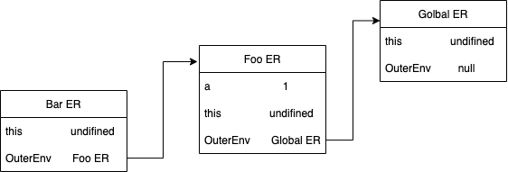

# 렉시컬 스코프

스코프에는 두 가지 스코프가 존재합니다. 동적 스코프와 렉시컬 스코프(정적 스코프) 입니다.

동적 스코프는 함수가 호출되는 시점에 동적으로 상위 스코프를 결정합니다.

정적 스코프는 상위 스코프가 동적으로 변하지 않고, 함수 정의가 평가되는 시점에 상위 스코프가 정적으로 결정됩니다.

자바스크립트는 렉시컬 스코프를 따릅니다. 따라서 **함수를 어디서 호출했냐가 아닌, 함수를 어디서 정의했는지에 따라 상위 스코프를 결정합니다.** 함수가 호출된 위치는 상위 스코프 결정에 아무런 영향도 미치지 못하므로 함수의 상위 스코프는 언제나 자기 자신이 정의된 스코프입니다.

이덕분에 함수 정의가 실행되어 생성된 함수 객체는 이렇게 결정된 상위 스코프를 기억해야 합니다. 함수가 호출될 때마다 함수의 상위 스코프를 참조해야 하기 때문입니다.

### 렉시컬 스코프와 클로저는 떼놓을 수 없이 함께 등장합니다. 그러나 스코프 단원에선 클로저에 대해선 설명하지 않으므로, 다음에는 클로저에 대해 알아보겠습니다.
